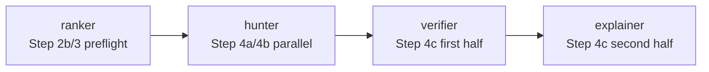

# review pipeline stages

`/pr-codex:review` は既存 Step 番号を維持したまま、責務を **ranker → hunter → verifier → explainer** の 4 logical stage として扱う。Step 4c を物理的に複数 Bash 実行へ分割せず、既存の temp → validator → `mv` による atomicity を保つ。

| Stage | Responsibility | Inputs | Outputs | Halting / failure |
|---|---|---|---|---|
| **ranker** | PR の規模・risk/area・実行 depth を分類し、F8 routing が差し込める interface を作る | GitHub PR metadata, `files[]`, `pr.diff` | `run-plan.json` (`risk_tags`, `recommended_mode`, `depth_actual`, `selected_hunters`) | metadata/files/diff/run-plan 生成失敗は `status.failed_stage=ranker` |
| **hunter** | Claude Code / Codex CLI が読み取り専用で候補 finding を広めに集め、structured output (`schemas/hunter-result.v1.json`) を返す | `run-plan.json`, `pr.diff`, `pr.diff.ranges.txt`, shallow clones | `claude-review.json`, `codex-review.json`, `findings.candidates.json` (`merge_hunter_results.py` が検証・合成) | hunter timeout/非ゼロ/`HUNTER_DIFF_UNAVAILABLE`/hunter result schema 不適合/candidate validation 失敗は `failed_stage=hunter` |
| **verifier** | 候補を正規化し、4軸 + evidence ladder + counterexample で絞る。posting policy もここで焼き付ける | `findings.candidates.json`, structured hunter results, `metadata.json`, `pr.diff.ranges.txt`, `schemas/findings.v1.json` | `findings.verified.json`, `validation-report.json` | 4軸 gate、range gate、fingerprint gate、Must Fix 件数 gate、同梱 validator 失敗は `failed_stage=verifier` |
| **explainer** | verified findings から postable な `review.md` と local-only 補足を派生生成する | `findings.verified.json`, `validation-report.json`, `run-plan.json` | `review.md` | temp write / final `mv` 失敗、派生成果物の不整合は `failed_stage=explainer` |

## Guardrails

- `findings.candidates.json` は hunter → verifier 境界の debug artifact。`id` / `fingerprint` / `axes` / `evidence_level` / `posting` は verifier が確定するため、candidate では省略または不一致を許す。
- `findings.verified.json` だけが canonical source of truth。`/pr-codex:send` は verifier を迂回して GitHub 投稿しない。
- private chain-of-thought、raw sensitive logs、`claude.log` / `codex.log` は stage artifact として公開・派生投稿しない。
- F8 hook: `selected_hunters` は ranker 出力の interface として配列のまま維持するが、F4 では `["claude","codex"]` 固定テンプレートを変えない。
- F11 hook: `findings.candidates.json` / `findings.verified.json` / `validation-report.json` のファイル名を固定し、future scoring runner の入力にする。
